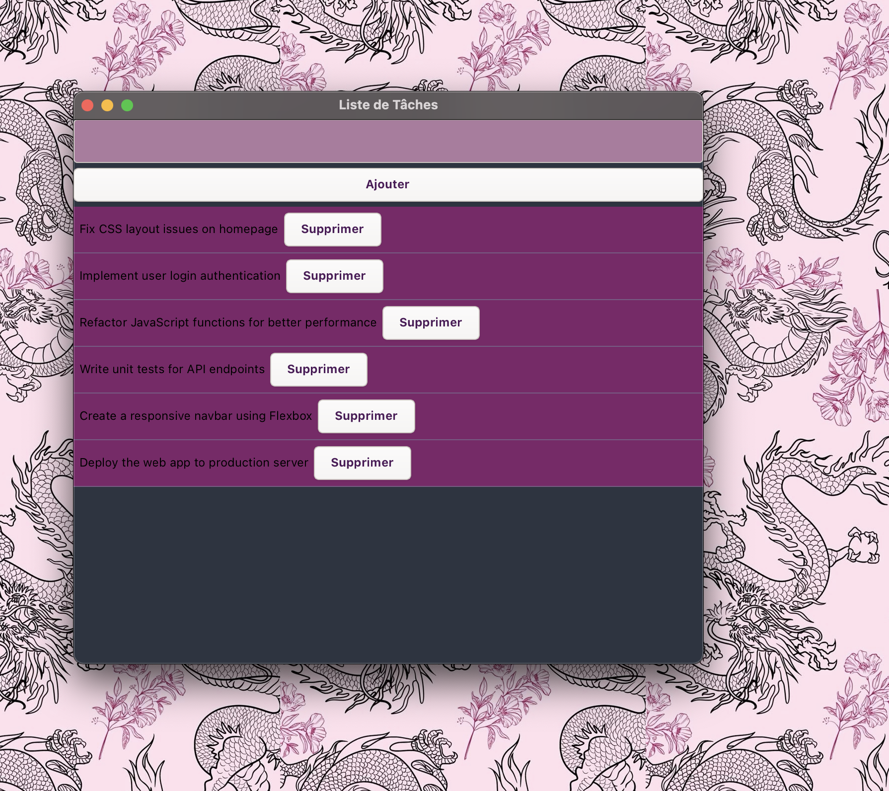

# 🗂️ To Do List en GTK4

Ce projet est une application graphique écrite en **C** utilisant la bibliothèque **GTK4**. Elle permet de gérer une liste de tâches (ajout et suppression) via une interface utilisateur simple et esthétique.

---

## 🎯 Objectif du projet

L'objectif principal de ce projet est d'explorer la **programmation en C avec GTK4**, tout en construisant une application **graphique fonctionnelle** :

- Comprendre la gestion des signaux et des événements dans GTK.
- Manipuler des structures de données dynamiques.
- Appliquer du style CSS dans une interface GTK.
- Organiser son code avec des fichiers `.c` / `.h` et un `Makefile`.

---

## 🧠 Fonctionnalités

- ✅ Ajouter une tâche
- ✅ Supprimer une tâche de la liste
- ✅ Interface graphique avec `GtkEntry`, `GtkButton`, `GtkListBox`
- ✅ Design personnalisé avec un fichier `style.css`

---

## 🛠️ Structure du projet

```bash
.
├── main.c         # Point d'entrée principal de l'application GTK
├── to_do.c        # Fonctions de logique (ajout/suppression de tâches)
├── to_do.h        # Déclarations des fonctions et structures
├── style.css      # Fichier CSS pour styliser l'interface GTK
├── Makefile       # Fichier pour compiler et nettoyer le projet
├── to_do_list     # Binaire généré après compilation


Voici une To-Do List application:

